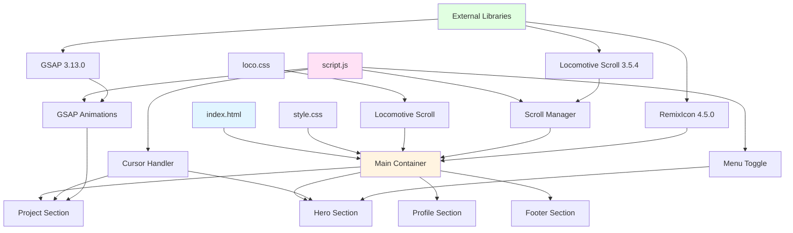
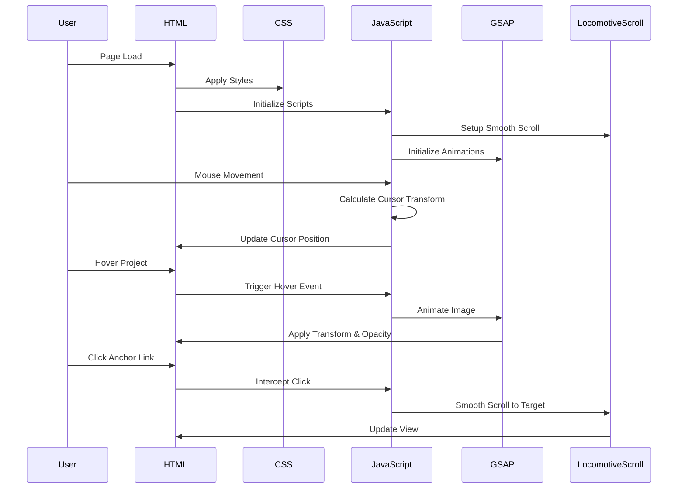

# 🎨 DevFolio - Modern Developer Portfolio

<div align="center">


**A sleek, interactive developer portfolio featuring smooth animations, custom cursor effects, and a modern UI/UX design.**

[Live Demo](https://devfolio-peach-two.vercel.app) • [Report Bug](https://github.com/RAj2027/devfolio/issues) • [Request Feature](https://github.com/RAj2027/devfolio/issues)

</div>

---

## 📑 Table of Contents

- [✨ Features](#-features)
- [🎯 Demo](#-demo)
- [🏗️ Architecture](#️-architecture)
- [🔧 Component Breakdown](#-component-breakdown)
- [🚀 Getting Started](#-getting-started)
- [💻 Technologies Used](#-technologies-used)
- [📱 Responsive Design](#-responsive-design)
- [🎨 Customization](#-customization)
- [📈 Performance](#-performance)
- [🤝 Contributing](#-contributing)
- [📄 License](#-license)
- [📞 Contact](#-contact)

---

## ✨ Features

### 🎭 Interactive Elements
- **Custom Cursor**: Dynamic cursor with squeeze effects based on movement direction
- **Smooth Scrolling**: Locomotive Scroll integration for butter-smooth page transitions
- **Hover Animations**: GSAP-powered image hover effects with rotation and scaling
- **Project Showcases**: Interactive project cards with image previews on hover

### 🎨 Design Highlights
- **Modern UI/UX**: Clean, minimalist design with dark theme
- **Typography**: Custom font implementation (Clash Display)
- **Responsive Layout**: Optimized for various screen sizes
- **Visual Feedback**: Blend mode effects and dynamic transformations

### 🔗 Navigation
- **Smooth Anchor Links**: Custom implementation for in-page navigation
- **Mobile Menu**: Toggle menu for smaller screens
- **Social Integration**: Direct links to LinkedIn, GitHub, Instagram, and Pinterest

---

## 🎯 Demo

### Key Sections

1. **Hero Section** 🏠
   - Eye-catching title and tagline
   - Availability status
   - Quick links to profile and work

2. **Project Gallery** 💼
   - CivicTrack - Community Issue Tracking Platform
   - Netflix UI Clone
   - ContriSpace - Collaborative Development Space
   - Additional projects showcase

3. **About Section** 👨‍💻
   - Personal introduction
   - Educational background
   - Call-to-action button

4. **Footer** 📧
   - Social media links
   - Copyright information

---

## 🏗️ Architecture

### System Overview



### Data Flow



---

## 🔧 Component Breakdown

<details>
<summary><b>🎯 Navigation Component</b></summary>

### Structure
```
#nav
├── #logo (Brand Link)
├── .menu (Navigation Links)
│   ├── WORK Link
│   ├── PLAYGROUND Link
│   └── CONTACT Link
└── #menu (Mobile Toggle)
```

### Functionality
- Responsive menu toggle for mobile devices
- Smooth scroll navigation to page sections
- Fixed positioning at page top

### Styling
- Flexbox layout for space-between alignment
- Custom font sizing with viewport units
- Hover effects with underline decoration

</details>

<details>
<summary><b>🎨 Custom Cursor Component</b></summary>

### Features
- **Dynamic Scaling**: Cursor scales based on movement speed
- **Direction Detection**: Squishes in the direction of movement
- **Hover Effects**: Enlarges when hovering over projects (2x scale)
- **Blend Mode**: Uses `mix-blend-mode: difference` for visibility

### Implementation
```javascript
// Key Functions
- updateCursor(x, y, xscale, yscale)
- cursorSquisher()
- Event listeners for mousemove
```

### CSS Properties
- `position: fixed` with `pointer-events: none`
- Transform-based positioning for performance
- Cubic bezier timing function for smooth transitions

</details>

<details>
<summary><b>📜 Locomotive Scroll Integration</b></summary>

### Configuration
```javascript
const scroll = new LocomotiveScroll({
    el: document.querySelector('#main'),
    smooth: true
});
```

### Features
- Container-based smooth scrolling
- Custom scrollbar styling
- Transform-based scroll effects
- Optimized performance with GPU acceleration

### Custom Implementations
- Anchor link interception
- Scroll-to-target functionality
- Hash management for clean URLs

</details>

<details>
<summary><b>💼 Project Gallery Component</b></summary>

### Structure
Each project card (`.projekts`) contains:
- Background container
- Hover image (absolutely positioned)
- Project title (`<h1>`)
- Year badge (`<h3>`)

### GSAP Animations
```javascript
// Image Transform Properties
- opacity: 0 → 1
- scale: 1 → 1.03
- rotate: -8° to +8° (clamped)
- x/y: Follow mouse position
```

### Interaction Flow
1. **Mouse Enter**: Cursor scales to 2x
2. **Mouse Move**: Image follows cursor with rotation
3. **Mouse Leave**: Image fades out, cursor resets

### Visual Effects
- Text opacity reduction on hover (0.35)
- Title translation on hover (1.8vw right)
- Smooth easing with `power3.out`

</details>

<details>
<summary><b>👤 Profile Section Component</b></summary>

### Layout
- Flexbox with gap spacing
- Profile image (circular, 15vw)
- Info container with description
- CTA button with hover effects

### Content
- Educational background
- Professional interests
- Skills and goals
- Action button ("Let's Talk")

### Extras Module
- YouTube channel promotion
- Additional call-to-action
- Icon integration

</details>

<details>
<summary><b>🔗 Footer Component</b></summary>

### Elements
- Copyright notice (© 2025)
- Creator credit
- Social media links
  - LinkedIn
  - GitHub
  - Instagram
  - Pinterest

### Styling
- Space-between layout
- Gap-based spacing (3vw)
- Consistent link styling

</details>

---

## 🚀 Getting Started

### Prerequisites

- Modern web browser (Chrome, Firefox, Safari, Edge)
- Basic understanding of HTML/CSS/JavaScript
- Text editor or IDE

### Installation

1. **Clone the repository**
   ```bash
   git clone https://github.com/RAj2027/devfolio.git
   cd devfolio
   ```

2. **Project Structure**
   ```
   devfolio/
   ├── index.html
   ├── style.css
   ├── loco.css
   ├── script.js
   └── Assets/
       ├── ClashDisplay/
       │   └── ClashDisplay-Regular.woff
       ├── profile.jpg
       ├── havoc.png
       ├── estudy.png
       ├── moviethingz.png
       └── yapzone.png
   ```

3. **Add your assets**
   - Place your profile image in `Assets/profile.jpg`
   - Add project thumbnails to the `Assets/` folder
   - Ensure font files are in `Assets/ClashDisplay/`

4. **Open in browser**
   ```bash
   # Using Python
   python -m http.server 8000
   
   # Using Node.js
   npx serve
   
   # Or simply open index.html in your browser
   ```

5. **Customize content**
   - Update personal information in `index.html`
   - Modify project links and details
   - Adjust social media URLs

---

## 💻 Technologies Used

### Core Technologies
| Technology | Version | Purpose |
|------------|---------|---------|
|  | 5 | Markup Structure |
|  | 3 | Styling & Layout |
|  | ES6+ | Interactivity & Logic |

### Libraries & Frameworks

#### 🎬 GSAP (GreenSock Animation Platform) v3.13.0
- **Purpose**: High-performance animations
- **Usage**: Image hover effects, transforms, and transitions
- **CDN**: `https://cdnjs.cloudflare.com/ajax/libs/gsap/3.13.0/gsap.min.js`

#### 🚂 Locomotive Scroll v3.5.4
- **Purpose**: Smooth scrolling experience
- **Usage**: Container-based smooth scroll with custom scrollbar
- **CDN**: `https://cdn.jsdelivr.net/npm/locomotive-scroll@3.5.4/dist/locomotive-scroll.min.js`

#### 🎨 RemixIcon v4.5.0
- **Purpose**: Icon library
- **Usage**: Arrow icons, social media icons
- **CDN**: `https://cdn.jsdelivr.net/npm/remixicon@4.5.0/fonts/remixicon.css`

### Custom Assets
- **Font**: Clash Display (Custom Web Font)
- **Color Scheme**: Dark theme with high contrast

---

## 📱 Responsive Design

### Viewport Units
The project extensively uses viewport units (vw, vh) for responsive scaling:
- Font sizes: `1.1vw` to `10vw`
- Spacing: `2.5vw` padding
- Images: `15vw` to `50vw` width

### Breakpoints (Recommended Additions)
```css
/* Mobile */
@media (max-width: 768px) {
  /* Adjust font sizes */
  /* Stack layouts vertically */
  /* Modify cursor size */
}

/* Tablet */
@media (max-width: 1024px) {
  /* Optimize spacing */
  /* Adjust image sizes */
}
```

### Mobile Menu
- Toggle-based navigation
- Hamburger menu at smaller screens
- JavaScript-controlled visibility

---

## 🎨 Customization

### Color Scheme

```css
:root {
    --s-color: rgb(6, 6, 6);      /* Primary Dark */
    --p-color: rgb(233, 233, 233); /* Primary Light */
    --p-fontSize: 1.1vw;           /* Base Font Size */
}
```

**To customize:**
1. Modify CSS variables in `style.css`
2. Update background and text colors
3. Adjust accent colors for buttons and links

### Typography

```css
@font-face {
    font-family: myfont;
    letter-spacing: 1.5vw;
    src: url(./Assets/ClashDisplay/ClashDisplay-Regular.woff);
}
```

**To change fonts:**
1. Replace font file in `Assets/ClashDisplay/`
2. Update `@font-face` src path
3. Adjust letter-spacing as needed

### Project Cards

Update project information in `index.html`:
```html
<a href="YOUR_PROJECT_URL" target="_blank" class="projekts">
    
    <div class="project-title">
        <h1>YOUR PROJECT NAME</h1>
    </div>
    <div class="date">
        <h3>YEAR</h3>
    </div>
</a>
```

### Animation Timing

Adjust GSAP animation parameters in `script.js`:
```javascript
gsap.to(img, {
    duration: 0.55,        // Animation duration
    ease: 'power3.out',    // Easing function
    rotate: 8,             // Max rotation angle
    scale: 1.03,           // Scale factor
});
```

---

## 📈 Performance

### Optimization Techniques

#### ✅ Implemented
- **will-change property**: Applied to animated elements
- **Transform-based animations**: GPU-accelerated
- **Debounced scroll events**: Reduces computation
- **Pointer-events: none**: On cursor overlay
- **Overwrite: true**: Prevents animation conflicts

#### 🎯 Recommended Improvements
- [ ] Image lazy loading
- [ ] Minified CSS/JS files
- [ ] WebP image format
- [ ] Preload critical assets
- [ ] Service worker for offline support

### Performance Metrics (Target)
- **First Contentful Paint**: < 1.5s
- **Time to Interactive**: < 3.0s
- **Lighthouse Score**: > 90

---

## 🤝 Contributing

Contributions are what make the open-source community amazing! Any contributions you make are **greatly appreciated**.

### How to Contribute

1. **Fork the Project**
   ```bash
   git clone https://github.com/RAj2027/devfolio.git
   ```

2. **Create your Feature Branch**
   ```bash
   git checkout -b feature/AmazingFeature
   ```

3. **Commit your Changes**
   ```bash
   git commit -m 'Add some AmazingFeature'
   ```

4. **Push to the Branch**
   ```bash
   git push origin feature/AmazingFeature
   ```

5. **Open a Pull Request**

### Contribution Guidelines
- Follow existing code style
- Comment complex logic
- Test thoroughly before submitting
- Update documentation as needed

---

## 📄 License

Distributed under the MIT License. See `LICENSE` file for more information.

```
MIT License

Copyright (c) 2025 RAj

Permission is hereby granted, free of charge, to any person obtaining a copy
of this software and associated documentation files (the "Software"), to deal
in the Software without restriction...
```

---

## 📞 Contact

### RAj Bardhan Singh

[](https://www.linkedin.com/in/raj-bardhan-singh-4o4)
[](https://github.com/RAj2027)
[](https://www.instagram.com)
[](https://in.pinterest.com/not_xpected)
[](https://www.youtube.com/@sketchyfunk)

**Project Link**: [https://github.com/RAj2027/devfolio](https://github.com/RAj2027/devfolio)

---

## 🙏 Acknowledgments

- [GSAP](https://greensock.com/gsap/) - Animation library
- [Locomotive Scroll](https://locomotivemtl.github.io/locomotive-scroll/) - Smooth scrolling
- [RemixIcon](https://remixicon.com/) - Icon library
- [Clash Display](https://www.fontshare.com/fonts/clash-display) - Typography
- Inspiration from various portfolio designs

---

<div align="center">

### ⭐ Star this repo if you find it helpful!

**Made with ❤️ by RAj**


</div>
